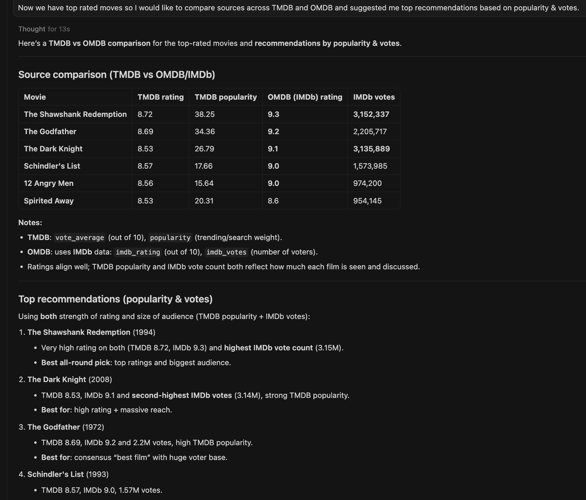

# FILM-FINDER MCP Server

A simple MCP (Model Context Protocol) server for fetching movie and TV show data from TMDB and OMDB APIs. Provides natural language capability for users to search, compare, and analyze movies through AI assistants.

## What is Model Context Protocol?

MCP allows AI assistants (like Claude in Cursor) to access external tools and data sources. This server exposes movie databases as MCP tools.

- Official guide: https://modelcontextprotocol.io/docs/getting-started/intro

## What it does

- Get popular movies and TV shows
- Search movie details by ID or title
- Compare ratings across TMDB and OMDB
- Basic caching for faster responses


## Setup

1. Get API keys:
   - TMDB: https://www.themoviedb.org/settings/api
   - OMDB: http://www.omdbapi.com/apikey.aspx

2. Add keys to `.cursor/mcp.json`:
```json
{
  "mcpServers": {
    "tmdb": {
      "command": "uv",
      "args": ["run", "--directory", "/path/to/tmdb-mcp", "python", "server.py"],
      "env": {
        "TMDB_API_KEY": "your_tmdb_key",
        "OMDB_API_KEY": "your_omdb_key"
      }
    }
  }
}
```

3. Install dependencies:
```bash
uv sync
```

## Testing

Use MCP Inspector for testing:

```bash
npx @modelcontextprotocol/inspector uv run python server.py
```

Then open http://localhost:5173 (or the URL shown in terminal).

**What is MCP Inspector?**  
A web-based developer tool for testing MCP servers during development. You can call tools, test prompts, and view resources without needing a full AI assistant setup.

- Docs: https://modelcontextprotocol.io/docs/tools/inspector

## Available Tools

**Movies:**
- `get_popular_movies` - Popular movies by language/page
- `get_top_rated_movies` - Highest rated movies
- `get_movie_details` - TMDB details by movie ID
- `get_movie_details_by_title` - OMDB search by title
- `get_movie_recommendation` - Discover movies by genre/language

**TV Shows:**
- `get_popular_tv_shows` - Popular TV shows
- `get_top_rated_tv_shows` - Highest rated shows
- `get_tv_show_details` - Details for specific show

**Other:**
- `authenticate_api_key` - Validate TMDB API key
- `generate_recommendation_explanation` - AI-powered movie recommendations

## Prompts

Pre-configured prompts to guide AI responses:
- `movie_recommendation_prompt` - Guide for recommending movies
- `tv_show_recommendation_prompt` - Guide for TV show suggestions
- `movie_analysis_prompt` - Compare and analyze movies
- `compare_movie_sources_prompt` - Compare TMDB vs OMDB data

## Resources

Static and dynamic data exposed by the server:
- `tmdb://config` - TMDB API configuration (languages, genres)
- `omdb://config` - OMDB API configuration
- `tmdb://movie/{movie_id}` - Dynamic movie details by ID
- `tmdb://movie/top_rated` - Top rated movies list

Use MCP Inspector's Resources tab to explore these. 


## Caching

Results are cached using Python's `cachetools` with TTL (Time To Live):

| Data Type | Cache Duration | Reason |
|-----------|----------------|--------|
| Popular movies/shows | 3 hours | Changes daily |
| Movie details | 24 hours | Static metadata |
| Top rated | 6 hours | Rarely changes |


## Example Usage in Cursor

Once configured in `.cursor/mcp.json`, ask Claude or any other LLM:
- "What are the top rated movies right now?"
- "Compare The Godfather ratings on TMDB vs OMDB"
- "Recommend me some movies similar to Inception"

The AI will automatically use your MCP tools to fetch and analyze movie data.



## Troubleshooting

**Server won't start:**
- Check that API keys are set in `.cursor/mcp.json`
- Verify `uv sync` ran successfully
- Look for errors in terminal logs
- Run from terminal `uv run python server.py` and check for logging.

## Project Structure

```
tmdb-mcp/
├── server.py           # Main MCP server
├── tmdb_client.py      # TMDB API client with caching
├── omdb_client.py      # OMDB API client
├── base_config.py      # Configuration and logging
├── pyproject.toml      # Dependencies
└── README.md           # You are here
```

## Notes

This is a learning project to understand MCP server development. The code works but could be improved with better error handling, more comprehensive tests, and additional features!
